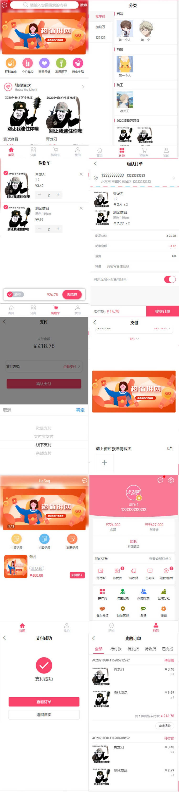
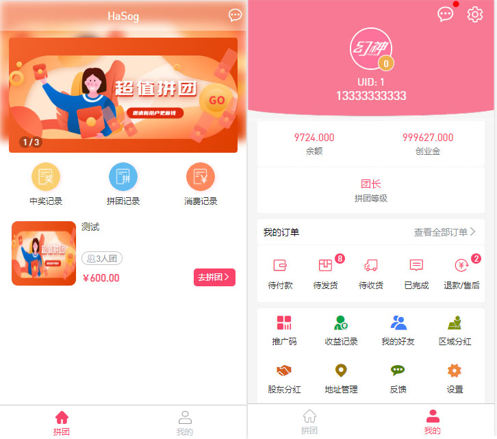

<h1 align="center">HaSog幻神商城</h1>

<p align="center">
<a href="https://www.hasog.com"></a>
<a href="https://www.hasog.com"></a>
<a href="https://gitee.com/orzice/hasog/members"></a>
</p>


原有项目运营2年，遇到了无数的难题和痛点，苦于市面上并没有相似需求的项目，此项目专为解决需求痛点进行重新开发！加了很多新特性！基于 Tp6 开发的一个商城系统，适合刚起步的创业型公司。

**！！ 还在开发中！预计3月15日发布1.0.0 Bate版！！**

欢迎 Star！

问题反馈请 [传送至这里](https://www.hasog.com)

微信交流群：


## 开发团队
>  开发公司：幻神科技 https://www.hasog.com
>  负责人/主程：Orzice/小涛（吴英涛）
> 后端开发：梗集（王国骁） ，王火火（王琰豪）
> 前端开发：慵懒与猫（孙敬冉），M-A-O（张帆）
> UI设计：潮鳴り（姚羽）

## 特点
- 核心代码只做核心功能，拒绝乱七八糟！
- 更强大的插件功能
- 可支持打包 为 APP
- 可支持打包 为 小程序（微信，QQ，头条，抖音，百度）
- 多种支付方式随意切换（微信支付，支付宝支付，APP支付，线下付款，收款码转账支付）
- 精确到街道且更加强大的发货逻辑（如：禁止某村发货，2个地区运费不同）
- 更加安全的结构，项目内置HTTP请求解析，软件内置防火墙
- 千人千面，每个人都可以定制自己的首页！


## 运行环境
- PHP 7.2+
- Mysql 5.6 + （必须支持InnoDB）
- Redis


计划任务

> php think cron

队列

> php think queue:work --sleep=3 --tries=3

伪静态

> if (!-e $request_filename) {
>	rewrite  ^(.*)$  /index.php?s=/$1  last;
>}


## 安装
```shell
部署后访问自己的域名即可
```

## 使用说明


## 项目实例
在这里展示已经上线的例子

###  正常商城系统



### 拼团抽奖系统




## 常见异常


### 1. 不能注册，提示 没有默认值，Mysql相关。

```
Mysql配置，一般宝塔面板会出现这个问题。

sql-mode=NO_ENGINE_SUBSTITUTION,STRICT_TRANS_TABLES
改为↓
sql-mode=NO_AUTO_CREATE_USER,NO_ENGINE_SUBSTITUTION
```


